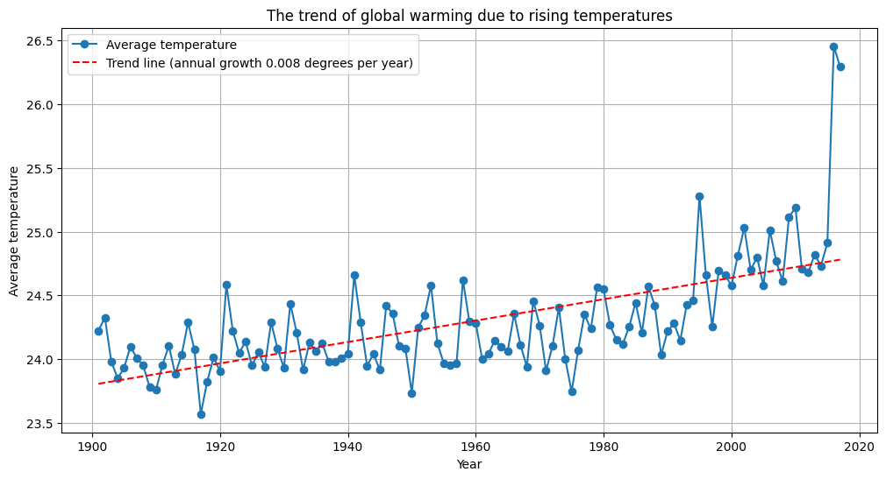

# Weather Data Analysis and Visualization
This Python project focuses on the analysis and visualization of historical weather data. It leverages various data analysis and visualization libraries to explore temperature trends over the years, visualize monthly temperature variations, and build a predictive model using machine learning techniques.
## Introduction
This project is designed to provide insights into historical weather data, allowing you to understand temperature trends, visualize monthly temperature variations, and even make predictions based on past records.
### As you can see we are facing global warming

## Data Preparation
The script reads weather data from a CSV file named 'Weather.csv'. You can replace this file with your own dataset if needed. Data preprocessing includes reshaping and renaming columns for better analysis.
## Data Visualization
The script includes multiple visualization features:

- A line plot showing average temperature trends by year.
- Box plots displaying warmest, coldest, and median monthly temperatures.
- Line plots of monthly temperature trends throughout history.
## Predictive Modeling
The script utilizes machine learning for predictive modeling. It trains a Random Forest Regressor on the data, evaluates its performance, and provides metrics like Mean Absolute Error (MAE), Mean Squared Error (MSE), and R-squared (R²).
- (MAE): 0.43191717443342226
- (MSE): 0.3225302657037267
- (R^2): 0.9737884829371249
## Note:

This description provides an overview of the project. If necessary, you can add more detailed information, results and conclusions from data analysis and experiments with models.
## Author
The author of this project: Aleksandr Loginov   https://github.com/LoginovAM-ds
## Connection
If you have any questions or suggestions, feel free to contact me via a.loginov.ds@gmail.com or https://www.facebook.com/profile.php?id=100074840106705.